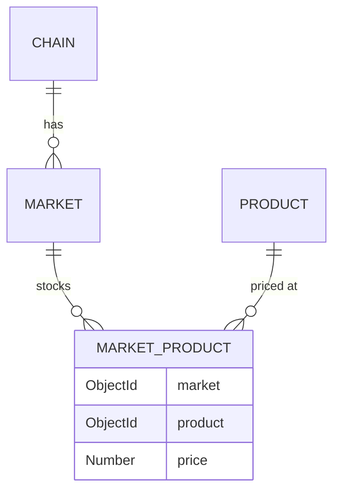

# Product Module

## Public Summary

Product catalog with multi-market pricing via a junction table. Supports category filtering, price ranges, and market-scoped queries.

## Internal Details

### Files

| File | Role |
|------|------|
| `product.controller.js` | HTTP handlers |
| `product.service.js` | Business logic |
| `product.routes.js` | Route definitions |
| `product.schema.js` | Zod validation |
| `product.model.js` | Mongoose Product schema |
| `product.repository.js` | Product data access |
| `marketProduct.model.js` | Junction table schema |
| `marketProduct.repository.js` | Junction data access |

### Endpoints

| Method | Path | Auth | Description |
|--------|------|------|-------------|
| `GET` | `/products` | Public | List products (filter by title, category, market, price range) |
| `GET` | `/products/categories` | Public | Category list (optionally scoped to market) |
| `GET` | `/products/:id` | Public | Product detail |
| `POST` | `/products` | JWT | Create product |
| `PUT` | `/products/:id` | JWT | Update product, including hand-added prices (`prices`, `removedMarkets`) |
| `DELETE` | `/products/:id` | JWT | Delete product |

### Data Models

**Product**
```
title      : String (unique, required)
category   : String (required)
description: String
image      : ObjectId → Image (optional)
```

**MarketProduct** (junction table)
```
market  : ObjectId → Market (required)
product : ObjectId → Product (required)
price      : Number (required)
lastSeenAt : Date (null for hand-added rows; set by the scraper on every run that sees the row)
```

Unique compound index on `(market, product)` — one price per product per market.

### Price Ownership

A row with `lastSeenAt: null` was added by an admin. Anything else belongs to the scraper, which overwrites its price and deletes it when the store stops listing the product (see the scraper module's stale price cleanup).

`PUT /products` accepts `prices: [{ market, price }]` and `removedMarkets: [marketId]` for hand-added rows only, and `addedPrices: [{ market, price }]` to add a hand-added price at a market the product isn't sold at yet (rejected if the market doesn't exist, already has a row for the product, or also appears in `prices`/`removedMarkets`). If any listed market is scraper-owned, the request is rejected with a 400 on `prices` and nothing is saved. If the scraper later starts listing a hand-added product, it stamps the row and takes it over.

### Many-to-Many Relationship



## Source Anchors

| Path | Relevance |
|------|-----------|
| `apps/server/src/modules/product/` | Controller, service, routes, schema, models (Product + MarketProduct) |
